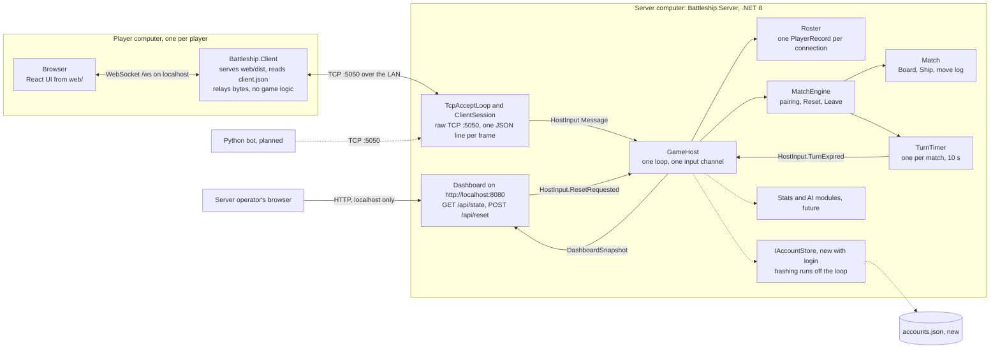
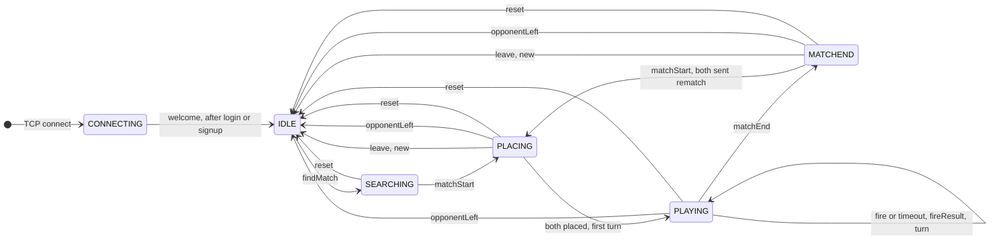

# Battleship backend requirements

Oct 9, 2026

The server is the single authority for the game: it holds both fleets, checks every shot, runs the turn timer and keeps the scores, while clients only send intentions and draw what the server tells them. It is `Battleship.Server`, a C# .NET 8 console app that speaks newline-delimited JSON over raw TCP on port 5050. Each player runs `Battleship.Client` on their own computer, which serves the React UI and relays the browser's WebSocket to that TCP port.

**For:** the C# backend team (`Battleship.Core`, `Battleship.Server`, tests).

**Status.** Frontend for login, sign-up and Home (leave a finished match) is done in `web/`. Backend is pending: until it lands, the server ignores `login`, `signup` and `leave` (`ProtocolJson.Parse` returns null for an unknown `type`), so the UI waits on "Logging in...".

**How to read this.** Sections 1 to 5 and 7 describe what already exists, with file paths. Section 6 lists the additional features (none started). Section 8 is the detailed work to do now: login, sign-up and Home. Section 9 lists the decisions made and the open ones. Everything was checked against the repo at `958f71c` plus the working tree. Names marked **(proposed)** do not exist yet. The wire contract is `docs/implement/protocol.md`; if this file disagrees with it, protocol.md wins (`AGENT.md`).

## 1. Architecture

One server process owns all game state. A single loop, `GameHost`, handles every input one at a time, so nothing else needs locks. Sockets, the turn timer and the dashboard only post inputs to it.



| Project | Target | Role |
|---|---|---|
| `src/Battleship.Core` | netstandard2.1 | Rules (`GameRules`, `Coord`, `Ship`, `Board`, `PlacementValidator`, `RandomPlacement`, `NicknamePolicy`) and the protocol DTOs plus `ProtocolJson`. No I/O. Used by the server and the tests, not by the client. |
| `src/Battleship.Server` | net8.0 | `Program.cs` (port 5050, dashboard URL), `Net/` (accept loop, sessions), `Host/GameHost.cs` (the loop), `Engine/` (`MatchEngine`, `Match`, `TurnTimer`), `Lobby/` (`Roster`, `PlayerRecord`), `Dashboard/` (ASP.NET minimal API). |
| `src/Battleship.Client` | net8.0 | Per-player local app: serves the built UI from `wwwroot/` (copied from `web/dist`) and relays WebSocket `/ws` to TCP without reading frames (`Relay.cs`). Reads `client.json`. |
| `web/` | Node 24, Vite | React and TypeScript UI. `src/protocol.ts` mirrors protocol.md. |
| `tests/` | net8.0 | `Battleship.Core.Tests`, `Battleship.Server.Tests` (engine, no sockets), `Battleship.IntegrationTests` (real server in process), `tests/fixtures/match-transcript.jsonl`. |

Invariants (`AGENT.md`): the server is authoritative, the client carries zero game logic, and the server never sends a player's ship positions to their opponent.

The match engine is the core. The account store, stats and AI only matter for login and the additional features, so the required game runs entirely in memory.

## 2. Required features

R1 to R15 are the server side of the fundamental requirements in `docs/instruction.md`. All of them already work. R4 changes with login: the username becomes the nickname.

| ID | Requirement | How it is implemented | Rubric | Status |
|---|---|---|---|---|
| R1 | Socket client-server model, two computers | `TcpAcceptLoop` listens on `IPAddress.Any:5050` (`Program.cs`). `Relay.cs` opens a `TcpClient` to `serverHost:serverPort` for each browser. | System setup, 2.0 | Done |
| R2 | No IP or port entry | Port 5050 is a constant in `Program.cs`. The client reads the server address from `client.json` beside it (`ClientConfig.cs`); the server prints its LAN addresses at startup (`LanAddresses.cs`). | 0.5 | Done |
| R3 | Client learns about other connected clients | `Roster.BuildLobby` builds the `lobby` event. `GameHost.Handle` sends it to every named client whenever the serialized roster changes (connect, name, status change, disconnect, reset). | 1.0 | Done |
| R4 | Nickname and welcome message | Today `join` goes through `NicknamePolicy.Normalize` and `GameHost.OnJoin` answers `welcome`. With login the account's username is the nickname: `welcome.nickname` keeps its name, and the placement screen shows "Welcome, {name}." (`PlacementScreen.tsx`). | 0.5 | Changes with login |
| R5 | Name and score on the client | `PlayerRecord.Score` lives on the roster, per connection. `matchStart.players` and `matchEnd.players` carry `{id, name, score}` (`Match.PlayerInfos`). | 0.5 | Done |
| R6 | 8x8 grid, 4 ships of 4 cells | `PlacementValidator.Validate`, called from `Match.Place`: exactly 4 ships, 4 cells each, on the grid, straight, contiguous, no overlap. A failure is `error invalid-placement` with the reason in `message`. | 0.5 | Done |
| R7 | Opponent ships hidden, start after both place | `Match` keeps both `Board`s privately. `placed` carries only the id. The second valid `place` moves the match to `Playing` and sends the first `turn`. `HiddenShipsTests` scans every frame of a whole match. | Spec | Done |
| R8 | 10-second turn timer | `MatchEngine.Track` starts `TurnTimer` for every `turn`. On expiry `HostInput.TurnExpired` reaches `Match.TurnExpired`, which fires a random cell the active player has not shot yet and sends `fireResult` with `auto: true`, then the next turn. The turn does not pass without a shot. The wire carries `turn.seconds` (10), not a deadline; the client countdown is display only. | 0.5 | Done |
| R9 | Hit or miss | `Match.Fire` rejects a wrong phase (`not-in-match`), the wrong player (`not-your-turn`), a cell off the grid (`out-of-range`) and a repeat (`already-fired`). `Board.Fire` decides hit, miss and sunk; `fireResult` goes to both players. | 0.5 | Done |
| R10 | Score and match end | When `allSunk`, `Match.Shoot` sets `MatchEnd`, adds 1 to the winner's `Score` and sends `matchEnd` with the updated scores. The timer is cancelled. | 0.5 | Done |
| R11 | Rematch | `Match.Rematch` sends `rematchPending` for the first request. The second one makes `MatchEngine.Rematch` replace the match with a new one (new `matchId`, boards cleared). A repeat request is ignored. | 0.5 | Done |
| R12 | Server shows online count and client list | `GameHost` copies a `DashboardSnapshot` after every input. The page at `/` polls `GET /api/state` every 500 ms (`Dashboard/index.html`). | 1.0 | Done |
| R13 | Server reset button | The button calls `POST /api/reset`, which posts `ResetRequested`. `MatchEngine.Reset` ends every match, empties the search, zeroes every score and makes named players idle. Every named client gets `reset`, then one `lobby`. | 1.0 | Done |
| R14 | Random first player | `Match` constructor: `_players[random.Next(2)]` when no first player is given. | 0.5 | Done |
| R15 | Winner starts the rematch | `MatchEngine.Rematch` passes `match.WinnerId` as `firstPlayerId`. | 0.5 | Done |

Pairing: `MatchEngine.FindMatch` pairs the first two players who sent `findMatch` (FIFO). A third player stays `searching` until a fourth arrives. `idle` players are never paired.

## 3. Event contract

There is no Socket.IO, no acknowledgement and no `area:action` naming. `docs/implement/protocol.md` is the frozen source of truth: UTF-8 JSON, one object per line ending in `\n`, a `type` field on every frame, camelCase fields. Receivers ignore unknown `type` values and unknown fields, and skip a malformed line without closing the socket (protocol.md section 1). The DTOs are in `src/Battleship.Core/Protocol/`, and `ProtocolJson.Parse` never throws.

Messages are perspective-free: both players get the same bytes, and each client compares ids with the `id` from `connected`.

**Client to server today (5 verbs)**

| Verb | Fields | Valid when |
|---|---|---|
| `join` | `nickname` | Once, before `welcome` (retired by login) |
| `findMatch` | none | Idle. A repeat while searching is ignored. No cancel in v1. |
| `place` | `ships`: 4 ships of 4 `[row,col]` cells | Placing, once per match |
| `fire` | `row`, `col` (both required) | Active player while playing |
| `rematch` | none | Match over. A repeat is ignored. |

**Server to client today (12 events)**

| Event | Fields | Sent when |
|---|---|---|
| `connected` | `id`, `protocolVersion` | First frame on every connection |
| `welcome` | `id`, `nickname` | Name accepted |
| `lobby` | `count`, `clients[{id, name, status}]` | Roster changed. `name` is null until `welcome`. `status`: `connecting`, `idle`, `searching`, `placing`, `in-match`. |
| `matchStart` | `matchId`, `players[{id, name, score}]`, `firstPlayerId` | Two players paired, or both asked for a rematch |
| `placed` | `id` | A placement was accepted (to both players) |
| `turn` | `activePlayerId`, `seconds` (10), `turnNumber` | A turn begins |
| `fireResult` | `by`, `target`, `row`, `col`, `result` (`hit` or `miss`), `sunk`, `sunkCells` (4 cells or null), `allSunk`, `auto` | Every shot, including a timeout auto-fire |
| `matchEnd` | `matchId`, `winnerId`, `players[{id, name, score}]` | All 4 ships of one player sunk. Scores already updated. |
| `rematchPending` | `from` | One player asked for a rematch |
| `opponentLeft` | `id` | The opponent's socket closed |
| `reset` | none | Dashboard RESET |
| `error` | `code`, `message` | A message was rejected. State does not change. |

Existing `error.code` values: `bad-nickname`, `invalid-placement`, `not-your-turn`, `already-fired`, `out-of-range`, `not-in-match`, `unknown`. Clients branch on `code`; `message` is English display text.

**New with login (specified in section 8)**

| Change | Items |
|---|---|
| New client verbs | `login`, `signup`, `leave` |
| New error codes | `bad-credentials`, `username-taken`, `invalid-input`, `already-logged-in` |
| Retired | verb `join`, code `bad-nickname`, the "Alice (2)" de-duplication |
| Totals | 7 client verbs + 12 server events = 19 message types (17 today) |

`web/src/protocol.ts` already carries the new verbs and codes (frontend done). It keeps `join` and `bad-nickname` until the backend PR removes them.

**Protocol change rule (`AGENT.md`, `tests/fixtures/README.md`).** A protocol change updates `protocol.md`, `web/src/protocol.ts` and the C# DTOs in one PR, otherwise it is not a protocol change. The golden transcript `tests/fixtures/match-transcript.jsonl` is read by the C# and TypeScript tests, so it changes in the same PR or CI fails. New `type` values for extras are additive (protocol.md section 9, no re-freeze) but follow the same rule.

**Dashboard (HTTP, not a socket).** `GET /api/state` returns `{tcpPort, lanAddresses, count, clients[{id, name, address, status, score, connectedAt}], matches[{id, phase, players, firstPlayerId, firstPickedAtRandom, activePlayerId, turnNumber, winnerId}], activity[{time, text}]}`. `POST /api/reset` returns 202. The server console and the dashboard activity list (last 30 lines, newest first) get the same text from `GameHost.Log`.

## 4. Match lifecycle

States are the client states of protocol.md section 3. Each pair of players moves through them; `PLAYING` repeats until one fleet is fully sunk.



- A rematch goes straight from `MATCHEND` to `PLACING`, never through `SEARCHING`, with the last winner first (R15). The first match's first player is random (R14).
- `IDLE` means in the lobby, not searching. Every return to `IDLE` needs a new `findMatch` before pairing again.
- `reset` sets every named client idle, abandons matches and searches, and zeroes scores. A client still in `CONNECTING` stays there.
- `leave` is new: it works from `MATCHEND`, and from `PLACING` for the race where the opponent's rematch just started a new match. It is rejected while `PLAYING` or `SEARCHING` (8.4).
- Server side, `Match` has three phases (`MatchPhase`: `Placing`, `Playing`, `MatchEnd`). A finished match stays in `MatchEngine` until a rematch, leave, disconnect or reset removes it.
- Lobby status follows the state: `connecting` until `welcome`, `idle`, `searching`, `placing` from `matchStart` until the first `turn`, then `in-match` (it stays `in-match` after `matchEnd`).

## 5. Data model

Only accounts (new) and, if the additional features are built, finished-match records and ratings need to outlive a restart. Everything about a live match stays in memory. The tables use the real class names; the original design's names are in brackets.

**Existing, in memory**

| Class (file) | Key fields | Lives | Notes |
|---|---|---|---|
| `PlayerRecord` (`Lobby/PlayerRecord.cs`) [ConnectedPlayer, SessionScore] | `Id` (`p1`, `p2`, never reused), `Address`, `ConnectedAt`, `Name` (null until `welcome`), `Status` (a `LobbyStatus` string), `Score` | While connected | `Score` is per connection and is lost on disconnect. Not stored on accounts. |
| `Roster` (`Lobby/Roster.cs`) | list of `PlayerRecord`, `Joined`, `BuildLobby()`, `Describe()` | Process | Only the loop touches it. |
| `ClientSession` (`Net/ClientSession.cs`) | socket, outgoing queue, `Id`, `Address` | While connected | No game state. |
| `Match` (`Engine/Match.cs`) | `Id` (`m1`, `m2`, ...), `Players[2]`, `Phase`, `FirstPlayerId`, `FirstPickedAtRandom`, `ActivePlayerId`, `TurnNumber`, `WinnerId`, `Moves`, private boards and rematch requests | Until rematch, leave, disconnect or reset | Rematch creates a new `Match`. |
| `MatchEngine` (`Engine/MatchEngine.cs`) | searching queue, matches by id, match counter | Process | One method per verb. Returns `Outbound` lists; `GameHost` sends them. |
| `Shot` (`Engine/Shot.cs`) | `TurnNumber`, `By`, `Target`, `Cell`, `Hit`, `Auto` | Inside `Match.Moves` | The full move log, ready for history. |
| `TurnTimer` (`Engine/TurnTimer.cs`) | one cancellation source per match | Process | Posts `TurnExpired(matchId, turnNumber)`. |
| `Board` (`Core/Board.cs`) [Fleet] | `Ships`, shot set, `Fire(Coord)` returns `ShotResult` | Inside `Match`, server only | Only code that decides hit or miss. |
| `Ship` (`Core/Ship.cs`) | `Cells` (4), hit set, `IsSunk` | Inside `Board` | |
| `Coord` (`Core/Coord.cs`) | `Row`, `Col` (readonly struct, 0 to 7) | | Wire form is `[row,col]`. |
| `ShotResult` (`Core/ShotResult.cs`) | `Hit`, `Sunk`, `AllSunk`, `SunkCells` | | Becomes `fireResult`. |
| `DashboardSnapshot` (`Dashboard/`) | counts, clients, matches, activity | Replaced after every input | Immutable, read by the web thread. |

**New with login (section 8)**

| Entity | Fields | Lives | Notes |
|---|---|---|---|
| `Account` **(proposed)** | `Username` (stored casing), `Salt` (16 bytes), `Hash` (32 bytes), `Iterations`, `CreatedAt` | `accounts.json` beside the server executable, loaded at startup | Unique ignoring case. Behind `IAccountStore`. |
| Pending signups, auth in flight **(proposed)** | `HashSet<string>` (OrdinalIgnoreCase), per-player flag | Memory, on the loop | Make concurrent signups and logins safe (8.4). |

**Future, for additional features (not started)**

| Entity | Key fields | Used by |
|---|---|---|
| Stats on `Account` | `elo`, `wins`, `losses`, `avatarColor`, optional `locale` | Elo, leaderboard, Thai, sound settings |
| `MatchRecord` | `matchId`, `mode`, players, `winnerId`, final scores, `eloChanges`, shots (from `Match.Moves`), both final fleets, `endedAt` | Match history, achievements |
| `AchievementUnlock` | `username`, `achievementId`, `unlockedAt` | Achievements |
| Ability charges, decoys, ghost ships, streak counters | per player or per match, in `Match` | Features 1, 2, 8 |

The session score (`PlayerRecord.Score`, zeroed by RESET) is separate from Elo and lifetime wins, which RESET must not touch.

## 6. Additional features

The rubric (`docs/instruction.md`) wants at least one AI feature (2 points); non-AI features are 1 point each; extras only count once the fundamentals are complete. The UI design for each is in `docs/frontend/handout.md`. The two AI modes carry most of the backend work. Sound and Thai need almost none.

Rules for all of them:

- Every new message is a new camelCase `type` (existing ones are `findMatch`, `fireResult`, `opponentLeft`). The names below are **proposals**. They follow the protocol change rule in section 3: protocol.md, `protocol.ts`, DTOs and the golden transcript in one PR. Do not change the meaning of an existing frame. An optional new field is allowed, because receivers ignore unknown fields.
- A feature that changes the rules is a separate mode: an optional `mode` field on `findMatch` (missing means classic). `MatchEngine.FindMatch` must then pair only searchers with the same mode.
- Server authority and secrecy stay: nothing may reveal an opponent ship except what the ability is designed to reveal. `HiddenShipsTests` needs an exception for exactly that.
- AI sits behind a server-side interface with a timeout and a rule-based fallback. It runs off the `GameHost` loop, like password hashing, and posts its answer back as a new `HostInput`. The 10 s `TurnTimer` keeps running: a late answer is dropped by checking the turn number, the way `TurnExpired` is. Any API key stays on the server in an environment variable. It never goes in `client.json` or in `web/`, which are served to browsers.
- A bot as a separate Python process (`bot/`, not scaffolded) is an alternative. It speaks the same protocol, so with login it must `signup` or `login` instead of `join`.

| # | Feature | Backend size | New protocol types (proposed) | New or changed data |
|---|---|---|---|---|
| 1 | AI Sonar & Decoy | Large | `useAbility`, `sonarResult`, `decoyHit`; `mode` on `findMatch`; optional `decoys` on `place` | Ability charges, decoys on the board |
| 2 | AI Ghost Fleet | Large | `ghostTurn`, `ghostUpdate`, `ghostResult`; `mode` on `findMatch` | Ghost ships in `Match` |
| 3 | Global leaderboard | Small | `leaderboardGet`, `leaderboard` | Reads account stats |
| 4 | Match history | Small | `historyList`, `history`, `historyDetail` | `MatchRecord` |
| 5 | Achievements and badges | Medium | `achievementsGet`, `achievements`, `achievementUnlocked` | `AchievementUnlock` |
| 6 | English and Thai | Small | none | Optional `locale` on `Account` |
| 7 | Sound effects and music | None | none | none |
| 8 | Kill-streak notifications | Small | `streakUpdate` | Streak count per player in `Match` |
| 9 | Elo rating | Medium | `ratingUpdate` (after `matchEnd`) | `elo` on `Account`, `eloChanges` on `MatchRecord` |
| 10 | Login and sign up | Medium | `login`, `signup`, `leave` | `Account` |

### 1. AI Sonar & Decoy

- Accept decoys on `place` for this mode and validate them like ships, with their own count and size rules. Classic mode ignores the field.
- Track ability charges per player per match. `useAbility {ability, row, col}` costs the player's turn (the engine sends the next `turn`, which restarts the timer) and is rejected with an error when no charges are left.
- Put the AI behind one interface, for example `ISonarAdvisor.Read(board, area)`, so the rules do not depend on how it works. Answer well inside the 10 s turn (aim for under 1 s); on timeout or failure use a plain rule-based reading.
- `sonarResult` goes only to the player who used the ability. A shot on a decoy sends `decoyHit` to both players instead of a `fireResult` hit or miss. Do not add a third value to `fireResult.result`: the TypeScript union is `'hit' | 'miss'`.

### 2. AI Ghost Fleet

- Create the ghost ships when a Ghost Fleet match starts. The AI decides where they go and how they act.
- If ghosts act between turns, run a ghost phase (`ghostTurn`): cancel the turn timer for it, then start the next turn normally (`ITurnTimer` already has `Start` and `Cancel`). Send only what players may see (`ghostUpdate`).
- Use `ghostResult` for a shot at a ghost; whether ghost hits count toward winning is open (section 9).
- Same AI rules as above: one interface, a time limit, a fallback, off the loop.

### 3. Global leaderboard

- `leaderboardGet {limit}` returns players sorted by Elo with wins, losses and win rate, plus the caller's own rank even outside the limit. Needs accounts, so it builds on feature 10.
- Hide players with fewer than a set number of finished matches as "Unranked".

### 4. Match history

- Save a `MatchRecord` when every match ends, from `Match.Moves` plus both final fleets (`Match` keeps its boards private today, so add an accessor for this). Writes to disk go to a background writer, not the loop.
- `historyList {page}` returns the caller's matches, newest first. `historyDetail {matchId}` returns one match, and only to its two players.

### 5. Achievements and badges

- Keep each rule as a small pure function over a finished `Match` (for example "first win", "won without a miss"), checked at match end.
- Store each unlock once and push `achievementUnlocked` to that player. The client never decides an unlock.

### 6. English and Thai

- The server sends codes and data, never sentences the client must show. `error.message` texts exist today, but clients branch on `code` and keep their own texts in each language (`web/src/login.ts` already does this for auth errors).
- `invalid-placement` has only a `message` from `PlacementValidator`, no sub-code. The UI validates placement itself (`web/src/placement.ts`), so this is rare; add `reason` codes only if Thai needs them.
- Usernames: the policy in 8.3 accepts any non-control character, so Thai works. Confirm it (section 9).

### 7. Sound effects and music

- No server work. The UI already synthesises sound (`web/src/sound.ts`: hit, miss, sunk, win, lose, with a mute toggle in `Header.tsx` kept in `localStorage`) from `fireResult` events it already receives. There is no music yet. Store settings on the account only if they should follow the player across computers.

### 8. Kill-streak notifications

- Count each player's streak on the server from `Match.Moves`, reset it on a miss, and send `streakUpdate {playerId, count}` to both players.
- Open: consecutive hits or consecutive ships sunk, and whether a timeout auto-fire that hits counts.

### 9. Elo rating

- At match end, update both ratings in one step with the standard Elo formula, where E is player A's expected score, S is 1 for a win and 0 for a loss, and K controls how fast ratings move (32 is common):

```latex
E_A = \frac{1}{1 + 10^{(R_B - R_A)/400}} \qquad R_A' = R_A + K\,(S_A - E_A)
```

- Send `ratingUpdate {changes[{id, elo, delta}]}` right after `matchEnd` so `matchEnd` itself stays unchanged and the result page can show "1,216 (+16)".
- Needs accounts. A disconnect or `leave` awards no win, so it changes no rating. RESET clears session scores only, not Elo. Persist ratings off the loop.

### 10. Login and sign up

Detailed in section 8. It is also the base for features 3, 4, 5 and 9, which need a stable identity.

## 7. Non-functional requirements

These rules apply to every feature; most protect the game from a client that sends wrong or dishonest data.

| Area | Requirement in this codebase |
|---|---|
| Anti-cheat | Never send a player the opponent's unhit ship positions. `placed` carries only an id; `fireResult.sunkCells` appears only for a ship that is already sunk. The server re-validates every `place` and `fire` (`Match`). `HiddenShipsTests.WholeMatch_NoFrameNamesAnUnhitOpponentShipCell` checks every frame of a match. |
| Input validation | `ProtocolJson.Parse` never throws: an unknown `type` or malformed line is skipped (protocol.md section 1), and `fire` without `row` or `col` is malformed (`[JsonRequired]`). Valid frames with bad values get an error code, never a crash. `GameHost.RunAsync` also catches an exception from any input and keeps the loop running. |
| Timing | The server owns all clocks. The wire carries `turn.seconds`, not a deadline. One `TurnTimer` entry per match: `Start` replaces the previous one, and it is cancelled on match end, leave, disconnect and reset. A stale `TurnExpired` is dropped by its `(matchId, turnNumber)`. |
| Concurrency | The single `GameHost` loop (one channel, one reader) serializes every input, so two shots arriving together cannot both count and `Roster`, `MatchEngine` and `Match` need no locks. Only I/O runs off the loop: session read and write loops, the timer delay, the dashboard reading an immutable snapshot, and (new) password hashing, which comes back as a `HostInput`. |
| Disconnects | `ClientSession.Close` posts `Disconnected` once. `MatchEngine.PlayerLeft` ends the match; the opponent gets `opponentLeft`, goes idle and keeps their score. No point is awarded and there is no reconnect (protocol.md section 9). The player leaves the roster, a `lobby` follows, and the dashboard updates. |
| Security | Passwords are hashed with PBKDF2 (section 8). The dashboard binds `http://localhost:8080`, so only the server computer can press RESET (`POST /api/reset` has no other check). The game port listens on all interfaces, unencrypted. Any AI key lives in a server environment variable. |
| Configuration | Hard-coded in `Program.cs`: `TcpPort = 5050`, `DashboardUrl`. Per client: `client.json` beside `Battleship.Client` (`serverHost`, `serverPort`, `webPort`; `--web-port` overrides). `client_example.json` is the tracked template; `client.json` is gitignored and the build copies the template when it is missing. The server computer must allow incoming connections in its firewall (README). New: `accounts.json` beside the server executable. |
| Logging | Console plus the dashboard activity list (`GameHost.Log`). Dashboard entries carry timestamps; console lines do not. Log connects, logins, match starts and ends, rematch requests, auto-fires and resets; an unexpected exception from an input goes to the console. Never log passwords or hashes. `ClientSession` currently logs the first 80 characters of every skipped line, which would print a `login` line; it must stop logging line content (8.5). |
| Performance | Two to a few players on one LAN. The loop does only in-memory work, so every response is near-instant. Hashing and AI calls run off the loop. |
| Testing | xUnit. `Battleship.Core.Tests` for rules and protocol, `Battleship.Server.Tests` for the engine with a fake `ITurnTimer` and no sockets, `Battleship.IntegrationTests` for a real server in process on loopback, including `TranscriptReplayTests`. CI runs `dotnet test` and, in `web/`, `npm test` and `npm run build`. |

## 8. Login, sign-up and Home (leave)

The home flow changes from "type a nickname" to "log in or sign up". The frontend sends three new verbs, `login`, `signup` and `leave`, and treats the account's username as the player's nickname everywhere. The server keeps a small account file (username plus a salted password hash), authenticates over the existing socket, and lets a player leave a finished match without disconnecting. Game rules do not change.

### 8.1 Summary

| Area | Today | Required |
|---|---|---|
| Client verbs | `join`, `findMatch`, `place`, `fire`, `rematch` | `login`, `signup`, `leave` added; `join` removed |
| Server events | 12 | Same 12. `welcome` and `lobby` are reused. |
| Identity | Nickname typed per connection, de-duplicated ("Alice (2)") | Account username, unique ignoring case, shown in stored casing, no de-dup |
| Persistence | None | `accounts.json` beside the server executable. Game state stays in memory. |
| Leaving a match | Only by disconnecting | `leave`; the player stays connected and logged in |

### 8.2 Wire contract

| Verb | Frame | Valid when |
|---|---|---|
| `login` | `{"type":"login","username":"alice","password":"hunter2hunter2"}` | Session not logged in |
| `signup` | `{"type":"signup","username":"Alice","password":"hunter2hunter2"}` creates the account and logs in | Session not logged in |
| `leave` | `{"type":"leave"}` | In a match that is in `MATCHEND` or `PLACING` (8.4) |

Property order is `type`, `username`, `password`. Success of `login` and `signup` is what `join` does today (`GameHost.OnJoin`): `welcome` to the sender, then the usual `lobby` to every named client.

```json
{"type":"welcome","id":"p1","nickname":"Alice"}
{"type":"lobby","count":1,"clients":[{"id":"p1","name":"Alice","status":"idle"}]}
```

`nickname` is the account's stored username casing even if the player typed `alice`. Keep the field name `nickname`.

**Failures** (`error {code, message}`; errors never change state, and the same session may retry)

| `code` | Sent when | Notes |
|---|---|---|
| `invalid-input` | `signup`: username or password breaks 8.3. `login`: username (after trim) or password is empty. | Message may name the rule. |
| `username-taken` | `signup` for a name that exists (ignoring case) or is reserved by a signup in flight | |
| `bad-credentials` | `login`: unknown user or wrong password | Same message and timing for both. Never say which part was wrong. |
| `already-logged-in` | `login`: password correct, but the account is online on another session | Only after the password verified, so it cannot probe who is online. The first session keeps playing. |
| `unknown` | Login or signup while this session is logged in ("You are already logged in."), or while one is running ("Already logging in."), or the account file could not be written ("Could not save the account.") | `unknown` already exists in `ErrorCodes`. |
| `not-in-match` | Existing meaning, plus `leave` outside a leavable match | |

Message texts are placeholders (the frontend branches on `code`, its texts are in `web/src/login.ts`). A message never echoes the password. No frame carries a hash or salt. After the change a `join` line is an unknown `type` and is ignored (protocol rule 1).

### 8.3 Validation

One policy class in `Battleship.Core` is the single source of truth.

| Field | Rule | Applies to |
|---|---|---|
| Username | `Trim()`, then 1 to 16 chars (`string.Length`, UTF-16 units, as `NicknamePolicy` counts), no `char.IsControl` character | `signup`: `invalid-input` |
| Username uniqueness | `StringComparer.OrdinalIgnoreCase` against stored accounts, pending signups and online roster names | `signup` |
| Username on login | Trim, then case-insensitive lookup. Empty gives `invalid-input`. Too long, control characters or no such account give `bad-credentials`. | `login` |
| Password | 8 to 64 chars, **never trimmed**, any characters | `signup` |
| Password on login | Only "not empty" is checked (`invalid-input`). Any other mismatch is `bad-credentials`. | `login` |

A missing JSON field becomes `""` (the DTO default) and lands in the `invalid-input` rows. A JSON `null` is different: `System.Text.Json` 8 assigns null to the non-nullable `string` property (checked), so treat null as empty before validating. A field of the wrong JSON type (for example `"password":123`) makes `ProtocolJson.Parse` return null and the line is skipped with no reply, as `join` does today. That is acceptable, but the frontend must not send it.

Suggested: replace `src/Battleship.Core/NicknamePolicy.cs` with a **(proposed)** `UsernamePolicy` (`MaxLength = 16`, `Normalize(string? raw)` returns the trimmed name or null, no de-dup) and a **(proposed)** `PasswordPolicy` (`MinLength = 8`, `MaxLength = 64`). They stay in Core (no crypto) so `Battleship.Core.Tests` covers them. Cheap guard: on `login`, a password longer than 64 can skip hashing and return `bad-credentials`.

### 8.4 Server behaviour

**Verb by session state**

| Verb | Not logged in | Logged in, no match | In a match |
|---|---|---|---|
| `login` / `signup` | process (flow below) | `unknown` "You are already logged in." | same |
| `findMatch` | `not-in-match` | existing | existing |
| `place`, `fire`, `rematch` | `not-in-match` | `not-in-match` | existing |
| `leave` | `not-in-match` | `not-in-match` (also while searching) | `PLACING` or `MATCHEND`: leave. `PLAYING`: `not-in-match`. |

"Not logged in" is `PlayerRecord.Name == null` (`HasJoined`, used by `Roster.Joined`, `MatchEngine.Reset` and `GameHost`; renaming it `IsLoggedIn` is optional). Because hashing is off the loop, a verb sent right behind a `login` in the same TCP write (as `HarnessTests.FrameSplitAcrossWrites_AndTwoFramesInOneWrite_AreBothRead` does with `join` and `findMatch`) is handled while the hash runs and gets `not-in-match`. Clients must wait for `welcome`.

**Login and sign-up flow** (on the `GameHost` loop unless noted)

1. `OnMessage` finds the `PlayerRecord`; if missing, return (existing behaviour).
2. Already logged in: `error unknown "You are already logged in."`. Auth already in flight for this player: `error unknown "Already logging in."`.
3. Validate (8.3). Failure: `invalid-input`.
4. **signup:** if `IAccountStore.Find(name)` is non-null or the pending set holds it, reply `username-taken`. Otherwise add the name to the **pending set** (`HashSet<string>(StringComparer.OrdinalIgnoreCase)`, proposed), mark the player "auth in flight", then `Task.Run`: generate a salt and hash. **login:** `Find(name)` on the loop, capture the record's salt, hash and iterations, mark in flight, then `Task.Run`: hash and compare. For an unknown account, hash against a dummy salt anyway (8.5) and report "not verified".
5. The task never touches game state. It ends by posting `HostInput.AuthCompleted(...)` **(proposed new record in `HostInput.cs`)** with the player id, kind, username, and either the new salt and hash (signup) or a verified flag (login). A thrown exception must also post an `AuthCompleted` (failure), so the reservation and in-flight mark are always cleared.
6. The `AuthCompleted` handler clears the in-flight mark and, for signup, the pending name. Then it re-checks, and **drops silently** (no account, no frames) if the session is gone or already logged in.
   - signup: the name must still be free, then `TryAdd` (persists, 8.6). A write failure gives `unknown "Could not save the account."` and frees the name.
   - login: not verified gives `bad-credentials`. Verified, but another roster entry has the same name (OrdinalIgnoreCase), gives `already-logged-in`.
   - success: `player.Name = account.Username` (stored casing), `player.Status = LobbyStatus.Idle`, send `Welcome { Id, Nickname }`, `Log(...)`. The before/after diff in `GameHost.Handle` then sends the `lobby` after the welcome. Failures change no roster state, so no `lobby`.

`IAccountStore` and the roster are only touched by the loop, so neither needs locks.

**Concurrency requirements**

- A 600,000-iteration PBKDF2 must never run on the loop: it would freeze every match and turn timer. Measured here: about 90 ms on a Mac with .NET 8; expect 100 to 300 ms on classroom laptops.
- Two simultaneous signups for one name (any casing): exactly one succeeds, the other gets `username-taken` (pending set).
- Two sessions logging into one account at once: exactly one gets `welcome`, the other `already-logged-in` (completion re-check).
- Optional: cap concurrent hashes (for example a `SemaphoreSlim`) so a flood of logins from the LAN cannot exhaust the thread pool. One auth in flight per session already bounds each connection.

**Names everywhere.** The username is the nickname in `welcome.nickname`, `lobby.clients[].name`, `matchStart` and `matchEnd` `PlayerInfo.Name` (`Match.PlayerInfos` reads `PlayerRecord.Name`), the dashboard Nickname column (`DashboardClient.Name`; the header in `Dashboard/index.html` may become "Username"), the activity log ("p1 joined as X" becomes "p1 logged in as X" or "signed up as X"), `Roster.Describe`, and "Welcome, {name}." on the placement screen. Scores stay on `PlayerRecord.Score`, per connection, reset on disconnect as today, and are **not** stored in accounts.

**`leave`.** Add `MatchEngine.Leave(string playerId)` **(proposed)**, called from a new `case Leave:` in `GameHost.OnMessage`.

- Valid only if `MatchOf(playerId)` exists and its `Phase` is `MatchEnd` or `Placing`. The `Placing` case covers the race where the opponent's rematch starts a new match as the player presses Home. Otherwise reply `not-in-match` (the same pattern as `Match.Rematch`).
- It behaves like the disconnect path `MatchEngine.PlayerLeft`: `End(match)` removes the match (a pending rematch request lives inside `Match`, so it is dropped) and cancels its timer; the opponent goes idle and gets `OpponentLeft { Id }`.
- **Difference from disconnect:** `PlayerLeft` sets only the survivor idle, because the leaver is removed from the roster afterwards. For `leave` the leaver stays, so `Leave` must also set the leaver's `Status = LobbyStatus.Idle`. Both keep their `Score`. The leaver stays connected and logged in with the same `Name`.
- The leaver gets no dedicated event. Both statuses changed, so `GameHost.Handle` sends the usual `lobby` to everyone. Frame order: `opponentLeft` to the opponent, then `lobby`. The client goes home locally and waits for a `lobby` that lists it idle.
- If both press Home, the second `leave` finds no match and gets `not-in-match`, which the frontend ignores. Add a `Log(...)` line such as "Alice left match m1".

**Sessions**

- Disconnect frees the account: `OnDisconnected` removes the roster entry, so the name is no longer online. A client that vanishes without closing the socket (cable pull) keeps the account until TCP notices; there are no heartbeats (protocol.md section 9).
- No reconnect or resume: a browser refresh is a new session and needs a new login.
- Dashboard RESET is unchanged: logged-in players stay logged in (`Reset` makes named players idle and zeroes scores).

### 8.5 Passwords and secrets

**Hashing.** PBKDF2-HMAC-SHA256 through `Rfc2898DeriveBytes.Pbkdf2(password, salt, iterations, HashAlgorithmName.SHA256, 32)` (this `string` overload exists in .NET 8 and returns 32 bytes), 600,000 iterations (OWASP guidance), a per-user 16-byte salt from `RandomNumberGenerator.GetBytes(16)`, compared with `CryptographicOperations.FixedTimeEquals`. Store the iteration count per record so it can be raised later, and verify with the record's own count. .NET 8 has no built-in scrypt, which is why PBKDF2 replaces `crypto.scrypt` from the first draft of this document (approved).

Put the hasher in `Battleship.Server` **(proposed `Accounts/` folder)**, not Core: Core targets `netstandard2.1`, which lacks the static `Pbkdf2`. Make the iteration count a constructor argument (default 600,000; tests pass a few hundred) and put the hasher behind a small seam so tests can inject a slow or gated one. Otherwise every test signup costs about 100 ms.

**No user enumeration by timing.** For an unknown username, still run a full PBKDF2 (dummy salt generated once at startup, default iteration count) and answer `bad-credentials`, so time and message match a wrong password.

**Slow repeated failures (recommended, optional).** Keep a failure count per `PlayerRecord.Address` in a bounded, loop-owned dictionary. After 5 consecutive failures from one address, the off-loop auth task awaits a short `Task.Delay` (for example 1 s, rising to 5 s) before posting `AuthCompleted`; a success clears the count. The delay lives in the task, never on the loop, and the one-auth-per-session rule limits parallel guesses. Do not lock accounts: a LAN prankster could lock the demo account. Players on the server computer all come from 127.0.0.1, so keep the delay short; tests inject a zero delay.

**Never store or log plain text**

- `Login` and `Signup` override `ToString()` to redact, for example `login { Username = alice, Password = *** }`. Today the risk is latent: `GameHost.RunAsync` prints `$"Error handling {input}: {ex}"`, and `HostInput.Message` is a record whose generated `ToString` prints `Body = {Body}`. The DTO base `ProtocolMessage` is a plain class, so today that prints only the type name (checked). It becomes a leak the moment someone makes a DTO a `record` or adds a `ToString` that prints fields. Keep the DTOs plain classes, add the override and a test.
- `HostInput.AuthCompleted` must not carry the plain password.
- `ClientSession.ReadLoopAsync` logs `Shorten(line)` (first 80 chars) for any line `ProtocolJson.Parse` rejects. A `login` with a wrong field type, or a truncated one, would print its password, and right now every `login` line is skipped this way and printed. Change it to log metadata only, for example `[p1] skipped a line that isn't a known message (112 chars)`. Do not try to redact by searching for `"password"` (JSON escapes defeat it). Update protocol.md section 1 rule 3 ("Log it") to "log that it was skipped, never its content". Do this first.
- Logs may contain usernames, never passwords or hashes. `Battleship.Client` (`Relay.cs`) passes bytes and logs no frames; no change needed.

### 8.6 Account storage

**Interface (proposed).** `IAccountStore` in `src/Battleship.Server/Accounts/`: `Find(username)` (case-insensitive, returns the account with stored casing or null) and `TryAdd(account)` (false when the name exists ignoring case; persists before returning true; throws on I/O failure and leaves memory unchanged). `Account` fields: `Username`, `Salt`, `Hash`, `Iterations`, `CreatedAt`. Two implementations: `FileAccountStore` and `InMemoryAccountStore` (tests). `GameHost` receives the store through its constructor; update `Program.cs` and `tests/Battleship.IntegrationTests/TestServer.cs`, the only two `new GameHost(...)` call sites.

**`accounts.json`**

| Item | Requirement |
|---|---|
| Path | `Path.Combine(AppContext.BaseDirectory, "accounts.json")`, beside the executable |
| Format | `{ "accounts": [ { "username": "Alice", "salt": "<base64>", "hash": "<base64>", "iterations": 600000, "createdAt": "2026-10-09T12:00:00+00:00" } ] }` (`System.Text.Json`: `byte[]` is base64 by default; camelCase names) |
| Load | Once at startup, before `new GameHost`. A missing file is an empty store. |
| Write | After every successful signup: write a temp file in the same directory, flush, then `File.Move(temp, path, overwrite: true)`. Delete the temp file on failure. |
| Corrupt or unreadable | Empty or whitespace-only file, bad JSON, bad base64, non-positive iterations, or two usernames equal ignoring case: **abort startup** with a message naming the path and the fix (repair or delete it), exit code 1 (the same pattern as the port-in-use branch of `Program.cs`). Never overwrite or "start fresh". |
| Git | Add `accounts.json` to `.gitignore` (it holds hashes). |
| Demo note | `scripts/publish.sh` and `scripts/publish.ps1` delete `publish/<rid>/server/` before publishing (`rm -rf`, `Remove-Item -Recurse -Force`), so republishing wipes accounts. Acceptable for the demo; say so in README.md. `dotnet clean` also removes a dev copy under `bin/`. |

### 8.7 Code map

| File | Change |
|---|---|
| `src/Battleship.Core/Protocol/ClientMessages.cs` | Remove `Join`. Add `Login`, `Signup` (`Username`, `Password`, redacting `ToString`) and `Leave`. Update the "5 client to server verbs" comment (now 7). |
| `src/Battleship.Core/Protocol/ProtocolJson.cs` | `Types` map: remove `"join"`, add `"login"`, `"signup"`, `"leave"`. |
| `src/Battleship.Core/Protocol/ProtocolMessage.cs` | Comment says "17 wire messages": now 19. |
| `src/Battleship.Core/Protocol/ServerMessages.cs` | `ErrorCodes`: remove `BadNickname`; add `BadCredentials`, `UsernameTaken`, `InvalidInput`, `AlreadyLoggedIn`. Update the `Welcome`, `LobbyClient.Name` and `ErrorCodes` comments. |
| `src/Battleship.Core/NicknamePolicy.cs` | Replace with `UsernamePolicy` and `PasswordPolicy`. |
| `src/Battleship.Server/Host/HostInput.cs` | Add `AuthCompleted`. |
| `src/Battleship.Server/Host/GameHost.cs` | Constructor takes the store (and hasher). Replace `OnJoin` with login and signup handling; add the `AuthCompleted` case in `Handle`, `case Leave:` in `OnMessage`, the pending set and in-flight marks; update log lines. `Handle` already computes `lobbyBefore` and `lobbyAfter` around every input, so `AuthCompleted` needs no lobby code. |
| `src/Battleship.Server/Engine/MatchEngine.cs` | Add `Leave` (8.4). `PlayerLeft`, `Reset`, `FindMatch` unchanged. |
| `src/Battleship.Server/Net/ClientSession.cs` | Stop logging line content (8.5). |
| `src/Battleship.Server/Lobby/PlayerRecord.cs`, `Roster.cs` | Comments say "nickname"; optional `IsLoggedIn` rename. |
| `src/Battleship.Server/Program.cs` | Load `FileAccountStore`, abort on a corrupt file, pass the store to `GameHost`. |
| `src/Battleship.Server/Dashboard/index.html` | Optional: "Nickname" header to "Username". |
| `src/Battleship.Server/Accounts/*` (new) | `IAccountStore`, `FileAccountStore`, `InMemoryAccountStore`, hasher. |
| `.gitignore` | Add `accounts.json`. |
| `web/src/protocol.ts` | Already has the new verbs and codes; remove `join` and `bad-nickname` in the same PR. |
| `web/src/gameReducer.test.ts` | Update expectations: it asserts a `welcome` with "Alice (2)" and replays the golden transcript. |

### 8.8 Tests to add or update

| Test file | Work |
|---|---|
| `tests/Battleship.Core.Tests/ProtocolJsonTests.cs` | `Transcript_CoversAll17Types` asserts 17; it becomes 19 (rename to `...All19Types`). `UnknownField_IsIgnored` uses `Join`: switch to `Login`. Add: `Login`, `Signup`, `Leave` parse; `login` with a wrong-typed field returns null; `{"type":"login"}` parses to empty strings; `"password":null` is handled as empty; `join` now returns null; `ToString` of `Login` and `Signup` has no password. |
| `tests/Battleship.Core.Tests/NicknamePolicyTests.cs` | Rename to `UsernamePolicyTests.cs`. Drop the three de-dup tests (`SecondDuplicate_GetsNumberTwo`, `ThirdDuplicate_GetsNumberThree`, `DuplicateCheck_IsCaseSensitive`). Keep empty, spaces, null, 16 vs 17 chars, trim. Add control characters (`"a\tb"`, `"a\u0000"`) and casing preserved. Add `PasswordPolicy` 7, 8, 64, 65 chars and no trimming. |
| `tests/fixtures/match-transcript.jsonl` (282 lines) and `tests/fixtures/README.md` | Rewrite the lobby scene: `signup` Alice and Bob, `invalid-input`, `username-taken`, `bad-credentials`, `already-logged-in`, and a `login` with different casing that welcomes the stored casing; drop `bad-nickname` and "Alice (2)". Add a `leave` from `MATCHEND` (the opponent gets `opponentLeft`, then `lobby` with all idle). Test passwords in the fixture are fine. Keep every message type and all five lobby statuses covered. Rewrite the README's "The story" and "All 17 message types". |
| `tests/Battleship.IntegrationTests/TranscriptReplayTests.cs` | The loop's `case OpponentLeft left:` disposes the client's socket whenever no client line caused the frame. A `leave` line directly precedes `opponentLeft`, so treat a sent `leave` as the cause (`triggered = true`) or the leaver is wrongly disconnected. Pass a low hash cost through `TestServer`. |
| `tests/Battleship.IntegrationTests/TestServer.cs` | `StartAsync` gets the store and hash cost (low in tests). Replace `JoinAsync` with `SignupAsync(name, password = default)` and `LoginAsync(...)`; each sends the verb and reads `welcome`, as `JoinAsync` does. Mechanical migration of about 30 `JoinAsync` call sites in `HappyPathTests`, `HiddenShipsTests`, `EdgeCaseTests`, `HarnessTests`, `ClientRelayTests`. |
| `tests/Battleship.IntegrationTests/HarnessTests.cs` | `TwoClients_SeeConnected_Welcome_Lobby`, `MalformedLine_IsSkipped...` and `TwoClientsFlooding10000Lines...` use `signup`. `ThreeClients_JoinAndLeave...` expects "Alice (2)": replace with `username-taken` for a repeat signup. `FrameSplitAcrossWrites...` pipelines `join` and `findMatch`: wait for `welcome` first, and add the pipelined case expecting `not-in-match`. |
| `tests/Battleship.IntegrationTests/EdgeCaseTests.cs` | `BadNickname_GetsBadNickname_AndCanTryAgain` becomes an `invalid-input` theory (empty, spaces, 17 chars, control char, short password) followed by a good signup. `SecondJoin_GetsUnknown...` becomes a second login or signup giving `unknown` and keeping the name. `VerbsInTheWrongState_GetNotInMatch` adds `leave`. |
| `tests/Battleship.IntegrationTests/ClientRelayTests.cs` | The fragmented `join` through the WebSocket becomes a fragmented `signup`. |
| `tests/Battleship.IntegrationTests/AuthTests.cs` (new) | Signup then login on a new session welcomes the stored casing; login ignores case; `bad-credentials` for a wrong password and an unknown user (same message); `already-logged-in` leaves the first session playable; disconnect frees the account; login while a login is in flight gives `unknown`; accounts survive a host restart with the same file; a corrupt file is detected. |
| Concurrency tests (in `AuthTests`) | Two clients sign up the same name at once: one `welcome`, one `username-taken`, with a gated hasher holding the first hash in flight so the overlap is deterministic. Disconnect while hashing creates no account and frees the name. Two logins to one account race to one `welcome` and one `already-logged-in`. |
| Secret-logging test | Send a malformed `login` with a marker password; capture `Console.Out` (non-parallel collection) and assert the marker never appears. |
| `tests/Battleship.Server.Tests/ResetAndLeaveTests.cs` (+ `MatchmakingTests.cs`, `EngineSetup.cs`) | Engine-level `Leave` tests: in `MATCHEND` (opponent gets `OpponentLeft`, both idle, scores kept, timer cancelled, no match left); in `PLACING`; with a rematch pending (request dropped, no new match); in `PLAYING` gives `NotInMatch`; with no match or while searching gives `NotInMatch`; both can `FindMatch` again and pair as `m2`. `EngineSetup.Join` builds a `PlayerRecord` directly and needs no change. Rename `FindMatch_BeforeJoining_GetsNotInMatch` and `Reset_LeavesAClientThatHasNotJoinedConnecting` if `HasJoined` is renamed. |
| `tests/Battleship.Server.Tests/PasswordHasherTests.cs`, `AccountStoreTests.cs` (new) | Hasher: verify true and false, per-user salts differ, iteration count stored and used, the dummy path takes similar time. Stores (same cases on both implementations): case-insensitive `TryAdd` and `Find`, stored casing returned. File store: round-trip in a temp directory, atomic write leaves no temp file, the corrupt cases in 8.6 throw at load. |

### 8.9 Docs to update (same PR)

- `docs/implement/protocol.md`: section 2 message table and "(5 verbs)" to 7; section 3 state machine (CONNECTING to IDLE via `login` or `signup`; MATCHEND and PLACING to IDLE via `leave`); section 4 `welcome` ("trimming, de-duplication") and the `connecting` row of the lobby status table; the error table; section 5 (`join` out, `login`, `signup`, `leave` in); section 6 sequence; section 7 server rules (accounts, one session per account); section 8 TypeScript `ClientVerb` and the Python note "send `findMatch` after `welcome`" (a bot must log in first); section 1 rule 3 (no line content in logs); section 9 (passwords in clear text, see 8.11).
- `AGENT.md`: the Stage lines mention `NicknamePolicy` and "Protocol: frozen"; update them (accounts, `UsernamePolicy`, `accounts.json`).
- `docs/implement/userflow.md`: the journey and "Step 1 - Enter a nickname" become log in or sign up; add the result screen's Home button; the bot flow ("nickname").
- `docs/implement/implementation-plan.md`: also stale (`join` in the verb list, `NicknameScreen`, "5 verbs"). Not required, cheap to fix.
- `README.md`: "Run the demo": accounts are stored in `accounts.json` beside the server; republishing wipes it.

### 8.10 Frontend contract (done, in `web/`)

| File | Role |
|---|---|
| `web/src/protocol.ts` | Types for the verbs, events and error codes |
| `web/src/App.tsx` | Sends `login`, `signup` and `leave` |
| `web/src/screens/LoginScreen.tsx` | The log-in and sign-up form |
| `web/src/login.ts` | Client-side validation and the text per error code |
| `web/src/gameReducer.ts` | `wentHome` and `leaving`: after `leave` the client goes home locally and ignores `matchStart` until a `lobby` lists it idle |

The frontend validates the same rules as 8.3, but the server re-validates everything.

### 8.11 Known limitations and decisions to confirm

- **Plain-text passwords on the wire.** The TCP socket has no TLS, so passwords cross the LAN unencrypted. Acceptable for the classroom demo; say so in protocol.md.
- **No lockout.** Throttling failed logins is recommended but optional (8.5). No password change, account deletion or recovery.
- **Rubric.** `docs/instruction.md` ("Each player enters a nickname", and the 0.5-point row "Each player enters a nickname and sees a welcome message") expects a nickname. The username serves as the nickname and the placement screen shows "Welcome, {name}.". Confirm with the instructor (`docs/frontend/handout.md` says the same).
- **Assumptions to confirm with the frontend:** an empty `login` field gives `invalid-input` (the frontend never sends one: it validates first); `leave` during `PLAYING` gives `not-in-match` (the Home button only exists on the result screen). If `leave` races the opponent's disconnect, the server sees the sender already idle and answers `not-in-match`; the frontend shows it in its usual error toast, which is harmless.

### 8.12 Acceptance checklist

- [ ] `login`, `signup`, `leave` exist as DTOs; `join` and `BadNickname` are gone; `ProtocolJson.Types` updated; 19 types.
- [ ] `protocol.md`, `web/src/protocol.ts`, the C# DTOs and `match-transcript.jsonl` change in one PR.
- [ ] `signup` creates an account, logs in, replies `welcome` (stored casing) then `lobby`; `login` does the same for an existing account.
- [ ] Every failure returns exactly the code in 8.2; `bad-credentials` is indistinguishable for unknown user and wrong password, in message and timing.
- [ ] Username 1 to 16 trimmed, no control characters, unique ignoring case; password 8 to 64, never trimmed; JSON null handled as empty.
- [ ] PBKDF2-SHA256, 600,000 iterations, 16-byte random salt, fixed-time compare, iterations stored per record.
- [ ] Hashing runs off the loop; a running hash does not delay other matches or timers.
- [ ] Duplicate concurrent signup gives one winner; concurrent login to one account gives one `welcome` and one `already-logged-in`.
- [ ] Disconnect while hashing creates no account, frees the pending name, sends nothing.
- [ ] Second login on a logged-in session gives `unknown`; disconnect frees the account.
- [ ] `leave` works in `MATCHEND` and `PLACING` (including with a rematch pending), is rejected elsewhere, and matches the disconnect path with the leaver also set idle; the leaver stays connected and logged in.
- [ ] `accounts.json` beside the executable: loaded at startup, written atomically per signup, a corrupt file aborts startup, listed in `.gitignore`.
- [ ] `ClientSession` no longer logs line content; `Login` and `Signup` `ToString` redact; no password or hash in any log or frame.
- [ ] Username shown in welcome, lobby, `matchStart` and `matchEnd`, the dashboard and the activity log.
- [ ] Tests in 8.8 added or updated; `dotnet test` and `web` `npm test` pass.
- [ ] Docs in 8.9 updated, including the republish-wipes-accounts note.
- [ ] Rubric question raised with the instructor.

## 9. Open questions

Seven decisions are made; eleven are still open. The additional-feature questions can wait until a feature is chosen.

**Decided**

- [x] Account storage: `accounts.json` beside the server executable (8.6).
- [x] Turn timeout: the server auto-fires a random cell (`fireResult.auto: true`). The turn does not just pass (R8).
- [x] Pairing with three or more players: the first two to send `findMatch` (FIFO). Nobody picks an opponent.
- [x] Same account on two computers: rejected with `already-logged-in`; the first session keeps playing.
- [x] Home while a rematch is pending: the match and the pending request are dropped; the opponent gets `opponentLeft` and returns to the lobby.
- [x] Disconnect mid-match: the opponent gets `opponentLeft`, goes idle and keeps their score. No grace period, no reconnect, no point awarded (`MatchEngine.PlayerLeft`).
- [x] Reset: clears session scores and ends all matches and searches (`MatchEngine.Reset`); accounts and logins survive.

**Open**

- [ ] Where to store match records and ratings if features 3, 4 or 9 are built: the same `accounts.json`, a second file, or SQLite.
- [ ] Does RESET also clear Elo, history and achievements? This document proposes session scores only.
- [ ] AI Sonar & Decoy: sonar area size, exact count or rough strength, charges per match, number of decoys, and what exactly the AI decides.
- [ ] AI Ghost Fleet: do ghost ships move, can they be sunk, do their hits count toward winning, can they attack, and on whose board are they?
- [ ] Does a kill streak count consecutive hits or consecutive ships sunk, and does a timeout auto-fire hit count?
- [ ] Elo starting rating and K value, and whether AI-mode matches are rated.
- [ ] Which achievements to include.
- [ ] Can usernames contain Thai characters? The 8.3 policy allows them.
- [ ] Add the optional throttling of repeated failed logins (8.5)?
- [ ] Confirm with the instructor that the username counts as the nickname (rubric, 8.11), and accept clear-text passwords on the LAN.
- [ ] Confirm the three frontend assumptions in 8.11.
